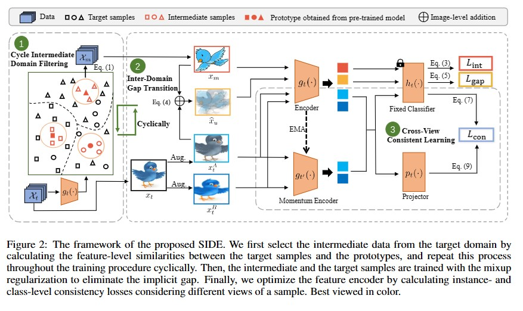

# Official Implementation for SIDE
[SIDE: Self-supervised Intermediate Domain Exploration for Source-free Domain Adaptation](https://arxiv.org/pdf/2205.14566.pdf)

This implementation is based on [proxy](https://arxiv.org/pdf/2205.14566.pdf).



### Prerequisites:
- python == 3.9
- pytorch ==1.0.0
- torchvision == 0.2.1

### Dataset:
- Please create the folder './data/.'.
- The datasets [Office](https://drive.google.com/file/d/0B4IapRTv9pJ1WGZVd1VDMmhwdlE/view), [Office-Home](https://drive.google.com/file/d/0B81rNlvomiwed0V1YUxQdC1uOTg/view), [VisDA-C](https://github.com/VisionLearningGroup/taskcv-2017-public/tree/master/classification) can be obtained from the official websites. Please modify the path of images in each '.txt' under the folder './data/'.  


### Training:
1. Train on the source domain
    ```python source.py -dset office --s 0 --max_epoch 50```
2. Train on the target domain
    ##### Office-31 dataset
	```python
    python target.py --dset office  --gpu_id 0 --s 1 --t 0 --max_epoch 100 --batch_size 64
    python target.py --dset office  --gpu_id 0 --s 2 --t 0 --max_epoch 100 --batch_size 64
	```


### Citation

If you find this code useful for your research, please cite our papers
```
SIDE: Self-supervised Intermediate Domain Exploration for Source-free Domain Adaptation
```

